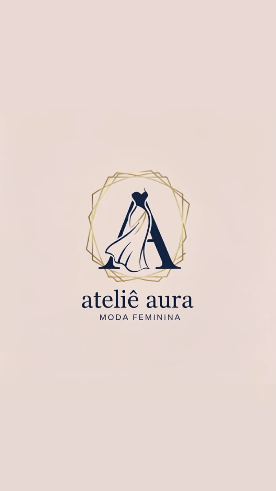

#  Ateliê Aura — Site Institucional

[]()
[](LICENSE)
[]()
[](https://wagnerribeiro-dev.github.io/Site_atelie_aura/)

> **Landing Page elegante e responsiva** desenvolvida para o *Ateliê Aura*, marca fictícia de moda feminina criada para a Feira de Carreiras 2025.  
> Este projeto demonstra boas práticas de design, organização e experiência do usuário.

---

## 📸 Prévia

<p align="center">
  
</p>

> 🌐 Visualize online: [Clique aqui para acessar o site](https://wagnerribeiro-dev.github.io/Site_atelie_aura/)

---

## ✨ Destaques

- 🎨 **Design moderno e minimalista** com foco em moda feminina.  
- 📱 **Layout 100% responsivo** e otimizado para dispositivos móveis.  
- ⚡ **Carregamento leve e rápido**, com imagens otimizadas.  
- 🧭 **Navegação fluida e intuitiva**, ideal para landing pages.  
- 💬 Estrutura clara para personalização e reuso em outros projetos.

---

## 🗂 Estrutura do Projeto

```

Site_atelie_aura/
│
├── index.html            # Página principal
├── css/                  # Estilos (opcional caso crie uma pasta)
├── js/                   # Scripts JS (opcional)
├── imagens/              # Fotos e logotipos
│   ├── logo_loja.jpg
│   ├── vestido_azul.jpg
│   ├── vestido_preto.jpg
│   └── ...
└── LICENSE               # Licença MIT

````

---

## 🧠 Tecnologias Utilizadas

| Tecnologia | Finalidade |
|-------------|-------------|
| **HTML5** | Estrutura semântica do site |
| **CSS3** | Estilização e responsividade |
| **JavaScript** | (Opcional) Interatividade e animações |
| **GitHub Pages** | Hospedagem gratuita e deploy automático |

---

## 🚀 Como Executar Localmente

```bash
# Clonar o repositório
git clone https://github.com/wagnerribeiro-dev/Site_atelie_aura.git

# Acessar o diretório
cd Site_atelie_aura

# Abrir o site no navegador
https://wagnerribeiro-dev.github.io/Site_atelie_aura/
````

Ou, se estiver usando o VS Code:

1. Instale a extensão **Live Server**
2. Clique com o botão direito em `index.html`
3. Selecione **“Open with Live Server”**

---

## 💅 Boas Práticas de UX/UI aplicadas

* Hierarquia visual clara (logo → slogan → catálogo → contato)
* Cores harmônicas (tons suaves e femininos)
* Tipografia elegante e legível
* Espaçamento generoso entre seções
* Imagens otimizadas com `alt` text para SEO e acessibilidade
* Chamadas à ação (CTA) visíveis e coerentes

---

## 🧩 Possíveis Extensões Futuras

* Adicionar **carrossel de fotos** (JS ou biblioteca Swiper.js)
* Criar **formulário de contato funcional** com integração a EmailJS
* Implementar **modo escuro/claro**
* Inserir **SEO tags** e metadados Open Graph
* Publicar como **template de portfólio**

---

## 👩‍💻 Autor

**Wagner  Gonçalves Ribeiro**
Desenvolvedor em formação | Foco em Front-End e UX/UI
🌐 [GitHub](https://github.com/wagnerribeiro-dev) • [LinkedIn](https://linkedin.com/in/)

---

## 📄 Licença

Distribuído sob a licença **MIT**.
Sinta-se livre para usar, modificar e distribuir este projeto.
Consulte o arquivo [`LICENSE`](LICENSE) para mais detalhes.

---

## 💖 Agradecimentos

* Escola Arco-Íris – III Expo Carreiras  2025
* Professores e colegas pelo apoio no desenvolvimento
* Comunidade Open Source pela inspiração 

---

````

---

## 🎨 **2️⃣ STYLE_GUIDE.md (Guia de Estilo Visual)**

```markdown
# 🎨 Guia de Estilo — Ateliê Aura

Este guia define os elementos visuais e padrões de design usados no site do **Ateliê Aura**, garantindo consistência e identidade visual.

---

## 🌈 Paleta de Cores

| Função | Cor | Hex |
|---------|------|------|
| Cor principal | Rosa claro | `#FADADD` |
| Cor secundária | Bege suave | `#FFF3E2` |
| Texto principal | Cinza escuro | `#333333` |
| Fundo geral | Branco | `#FFFFFF` |
| Ação (CTA) | Dourado suave | `#E2B659` |

---

## 🔤 Tipografia

- **Títulos:** `Playfair Display`, serif  
- **Texto base:** `Open Sans`, sans-serif  
- **Peso:** Regular (400), Semi-bold (600), Bold (700)  
- **Espaçamento:**  
  - `line-height: 1.6`  
  - `letter-spacing: 0.5px`

---

## 🧱 Layout

- **Estrutura:** Grid e Flexbox  
- **Container principal:** largura máxima de `1200px`, com `padding: 20px`  
- **Responsividade:**  
  - Mobile-first  
  - Breakpoints principais: `480px`, `768px`, `1024px`

---

## 🖼 Imagens

- Usar proporção 4:5 (vertical) para fotos de produto.  
- Nomear arquivos de forma descritiva (`vestido_azul_frente.jpg`, `vestido_preto_costas.jpg`)  
- Inserir `alt` com descrição:  
  ```html
  
````

---

## 🔘 Botões

| Estado | Cor de Fundo | Texto  | Efeito                 |
| ------ | ------------ | ------ | ---------------------- |
| Normal | `#E2B659`    | Branco | Sombra suave           |
| Hover  | `#C9A04D`    | Branco | Escurece 10%           |
| Ativo  | `#A9853A`    | Branco | Leve redução de escala |

---

## 💬 Tom de Comunicação

* Amigável, leve e confiante
* Foco em elegância, feminilidade e exclusividade
* Exemplo de chamada:

  > “Descubra o encanto da nova coleção Aura 2025 — feita para realçar sua essência.”

---

## 📱 Responsividade

* Menu adaptável (hambúrguer no mobile)
* Imagens redimensionáveis (`max-width: 100%`)
* Tipografia ajustada conforme viewport
* Padding interno aumentado em telas grandes para equilíbrio visual

---

## 🧩 Componentes Reutilizáveis

* **Header**: logo + menu fixo
* **Hero section**: imagem grande + título principal
* **Catálogo**: grid de produtos (3x2 no desktop / 1x3 no mobile)
* **Footer**: links sociais + créditos